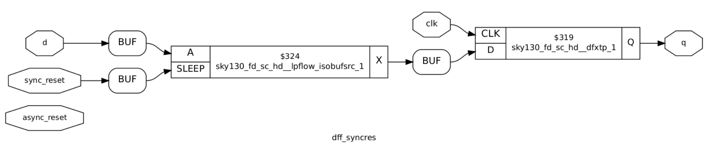

# RTL design using Verilog with SKY130 Technology


A 5 day cloud based virtual training workshop conducted by VSD-IAT from 23<sup>rd</sup> to 27<sup>th</sup> June. The link to the workshop webpage can be found [here](https://www.vlsisystemdesign.com/rtl-design-using-verilog-with-sky130-technology/). Below is a brief, day-wise documentation about the topics covered in the course, along with my implementations of the lab sessions.

## Table of Contents

- [Day 1 - Introduction to Verilog RTL Design and Synthesis](#day-1---introduction-to-verilog-rtl-design-and-synthesis)
  * [The Basics](#the-basics)
  * [Setting up the Lab Environment](#setting-up-the-lab-environment)
  * [Exploring Iverilog and GTKWave](#exploring-iverilog-and-gtkwave)
  * [Introduction to Yosys](#introduction-to-yosys)
  * [Libraries and their Significance](#libraries-and-their-significance)
  * [Exploring Yosys and SKY130PDKs](#exploring-yosys-and-sky130pdks)
- [Day 2 - Timing libs, Hierarchical vs. Flat Synthesis and Efficient Flop Coding Styles](#day-2---timing-libs-hierarchical-vs-flat-synthesis-and-efficient-flop-coding-styles)
  * [Further Information on .lib](#further-information-on-lib)
  * [Hierarchical vs. Flat Synthesis](#hierarchical-vs-flat-synthesis)
  * [Flop Coding Styles](#flop-coding-styles)
  * [Some Interesting Optimisations for Special Cases](#some-interesting-optimisations-for-special-cases)
- [Day 3 - Combinational and Seqeuntial Optimisations](#day-3---combinational-and-seqeuntial-optimisations)
  * [Introduction to Logic Optimisations](#introduction-to-logic-optimisations)
  * [Combinational Logic Optimisations](#combinational-logic-optimisations)
  * [Sequential Logic Optimisations](#sequential-logic-optimisations)

## Day 1 - Introduction to Verilog RTL Design and Synthesis

### The Basics
**Design:** <br>
The actual Verilog code or set of Verilog codes containing the intended functionalities of the hardware model to meet the required specs. Below is an example of a simple latch design written in Verilog HDL.
```verilog
module latch (input clk , input reset , input d , output reg q);
always @ (clk,reset,d)
begin
	if(reset)
		q <= 1'b0;
	else if(clk)
		q <= d;
end
endmodule
```

**Testbench:** <br>
A program used for the purposes of verifying the functional correctness of the design. In a test bench, stimuli (test vectors) are set up to check whether the design meets the required specifications. Below is an example test bench written written in Verilog to test the above latch design.
```verilog
`timescale 1ns / 1ps
module tb_latch;
	// Inputs
	reg clk, reset, d;
	// Outputs
	wire q;

        // Instantiate the Unit Under Test (UUT)
	latch uut (
		.clk(clk),
		.reset(reset),
		.d(d),
		.q(q)
	);

	initial begin
	$dumpfile("tb_latch.vcd");
	$dumpvars(0,tb_latch);
	// Initialize Inputs
	clk = 0;
	reset = 1;
	d = 0;
	#500 $finish;
	end

always #25 clk = ~clk;
always #30 d = ~d;
always #15 reset=0;
endmodule
```

**Testbench Setup** <br>


Note: The design may have 1 or more primary inputs and 1 or more primary outputs, however a testbench does not have any primary inputs or outputs. <br>

<br>**Simulator:** <br>
It is the tool used to simulate the design, and check for its adherence to the specifications. They can be used to apply the test bench to the design. The simulator tool used for this workshop is Icarus Verilog (Iverilog). A simulator works by looking for changes on the input signals, and evaluating the output signals only when a change in value is observed on the input. Below is the simulation flow for Iverilog.


Icarus Verilog is an implementation of Verilog HDL and operates as a compiler for Verilog simulation. When a design and testbench file is fed to this simulator, it outputs a VCD or Value Change Dump file. This VCD file holds data about the changes in the inputs and outputs of the source design. To view the contents of the VCD file in a visually comprehensible manner, a Waveform Viewer tool is used. For our lab sessions, the tool used is GTKWave, which is a GTK+ based wave viewer tool.

### Setting up the Lab Environment

In order to set up the tool flow and files for running the lab sessions, the following commands are used.
```
mkdir vsd
git clone https://github.com/kunalg123/vsdflow.git
git clone https://github.com/kunalg123/sky130RTLDesignAndSynthesisWorkshop.git
```
These should add the necessary directories for the lab environment, including the sky130 standard cell libraries, its standard cell verilog models, as well as the source design and testbench verilog files for the lab sessions. Once the git cloning is succesful, the following base directories should be available on your file system.


For lab sessions, the following verilog design files and testbench models of some basic digital circuit components are available under the verilog_files directory.


### Exploring Iverilog and GTKWave

To understand how to use these tools, lets explore Iverilog and GTKWave using an example of a simple 2:1 Multiplexer from the provided verilog_files directory. Let us take a look at the source verilog code for the design and testbench files, labeled as good_mux.v and tb_good_mux.v respectively.

<br>
*Fig.: Verilog code for 2:1 Multiplexer Design*

<br>
*Fig.: Testbench for 2:1 Multiplexer*

To simulate these files in Iverilog, the following command can be used.

```
iverilog good_mux.v tb_good_mux.v
```

If done correctly, Iverilog should create an output file by the name of a.out which will be added in the file directory. To generate the VCD file, we must execute the a.out file as follows.


Upon execution, a VCD file with the file extension .vcd will be generated. In our case, it is called tb_good_mux.vcd as that is the name specified in our test bench file. To view this VCD file in GTKWave, the following command is issued.

```
gtkwave tb_good_mux.vcd
```

This should generate the following response in the command terminal, as well as open up the GTKWave interface.


Finally, in the GTKWave interface panel, we can add the unit under test and select the inputs and outputs whose waveforms we want to view. Now we can confirm if the waveform of our 2:1 Multiplexer matches the design specifications or not. As visible from the below waveform, it does athere to the design specifications.


### Introduction to Yosys

Yosys is a framework for Verilog RTL synthesis. A synthesizer is a tool used for converting RTL based verilog code to netlist. RTL is the behavioural representation of the required specification in Verilog HDL. Netlist is the representation of the design in the form of standard cells present in the library. The Yosys synthesizer flow is as follows.


Yosys makes use of the commands ```read_verilog``` to read the verilog design, ```read_liberty``` to read the .lib, and ```write_verilog``` to write the netlist file. <br>

To verify the synthesis output, we can follow the same procedure as we did when verifying verilog design as the netlist must obey the same specifications as the original RTL design. In order to do this, we can pass the netlist file along with the original RTL testbench to our simulator and generate the VCD file. This VCD file can be viewed in the waveform viewer to confirm the behaviour of the synthesized netlist. This is shown below.


### Libraries and their Significance

A synthesizer conducts RTL to Gate level translation, wherein the behavioural design is converted to basic gates using the standard cell libraries provided, and connections are made between these gates. Libraries (.lib) are a collection of basic logic modules to implement any boolean logical functionalities, and may contain different flavours of the same gate such as 2-input/3-input or fast/slow.

**Need for Fast Cells:**

For a digital logic circuit, the combinational delay in the logic path determines its maximum speed of operation. Lets take an example of a basic combinational circuit shown below with two D Flip-flops and some combinational circuit betwen them, where CLK is the clock signal and DFF B holds the output of the circuit.


In this cicruit, the minimum size of 1 clock cycle is determined with the following relation

T<sub>CLK</sub> > T<sub>CQ_A</sub> + T<sub>COMBI</sub> + T<sub>SETUP_B</sub> <br>
where, <br>
&nbsp;&nbsp;&nbsp;&nbsp;&nbsp;&nbsp;&nbsp;&nbsp;&nbsp;&nbsp;&nbsp;&nbsp;T<sub>CQ_A</sub> is the propogation delay of DFF A <br>
&nbsp;&nbsp;&nbsp;&nbsp;&nbsp;&nbsp;&nbsp;&nbsp;&nbsp;&nbsp;&nbsp;&nbsp;T<sub>COMBI</sub> is the propogation delay of the combination circuit <br>
&nbsp;&nbsp;&nbsp;&nbsp;&nbsp;&nbsp;&nbsp;&nbsp;&nbsp;&nbsp;&nbsp;&nbsp;T<sub>SETUP_B</sub> is the setup time for DFF B (min. time before the clock edge that input data must be supplied) <br>

Hence, for maximum performance we need a smaller value of T<sub>CLK</sub>, which can be achieved by using faster cells to reduce the value of T<sub>COMBI</sub> as much as possible.

**Need for Slow Cells:**

In order to prevent any hold violations, we need cells that work slower. If we consider the above example, there must be a minimum amount of time during which the output of the combinational circuit must be stable after the active edge of the clock, for DFF B to reliably capture the data at its input. This minimum delay is known as the Hold Time of the circuit. Hence, the following condition must be sastisfied to prevent hold violations.

T<sub>HOLD_B</sub> < T<sub>CQ_A</sub> + T<sub>COMBI</sub> <br>

Thus, we need fast cells to meet performance requirements as well as slow cells to meet hold times in the .lib collection. To pick appropriate cells, the user must offer "constraints" to the synthesizer.

Note: As the primary load in a digital circuit is capacitance, the charge/discharge times of the capacitor decides cell delay. To discharge capacitors fast we need transistors capable of sourcing more current, thus needing wider transistors with more area and power requirements. While slower cells need narrow transitors with less area and power requirements.

### Exploring Yosys and SKY130PDKs

Let us explore Yosys and the SKY130 libraries using the same example of the simple 2:1 Multiplexer from the previous sections. To start yosys, we must use the command ```yosys``` in the terminal. Once invoked, the yosys prompt should appear as follows.


First, we must read the SKY130 libraries using the command ```read_liberty -lib filepath```. Next, we must read the design using the command ```read_verilog filename.v```. We must now specify the module name of the design we are synthesizing using the command ```synth -top modulename```. This can seen in the image below.


Once this is done, we can generate the netlist using the command ```abc -liberty your_library_filepath```. For our case, this would be ```abc -liberty ../my_lib/lib/sky130_fd_sc_hd__tt_025C_1v80.lib```. Succesfully executing this command should return the following report in the yosys prompt.


As visible in the report, yosys has found 3 inputs, 1 ouptut and 0 internal connections. This holds true for our example of the 2:1 Multiplexer. Further, yosys also mentions the cells used in the logic realisation. To observe a graphical view of the realisation, the command ```show``` can be used. This should generate the following graphic.


Finally, we can write the netlist using the command ```write_verilog -noattr filename.v```. Here, the property "-noattr" is used to prevent yosys from dumping extra information in the final netlist file. Let's name our file as good_mux_netlist.v and execute the command. The final netlist represention is shown below.


## Day 2 - Timing libs, Hierarchical vs. Flat Synthesis and Efficient Flop Coding Styles

### Further Information on .lib

The SKY130 library file used for this workshop is sky130_fd_sc_hd_tt_025C_1v80.lib

Here, <br>
&nbsp;&nbsp;&nbsp;&nbsp;&nbsp;&nbsp;&nbsp;&nbsp;&nbsp;**fd** is SkyWater Foundry <br>
&nbsp;&nbsp;&nbsp;&nbsp;&nbsp;&nbsp;&nbsp;&nbsp;&nbsp;**sc** is Standard Cell <br>
&nbsp;&nbsp;&nbsp;&nbsp;&nbsp;&nbsp;&nbsp;&nbsp;&nbsp;**hd** is High Density <br>
&nbsp;&nbsp;&nbsp;&nbsp;&nbsp;&nbsp;&nbsp;&nbsp;&nbsp;**tt** is Typical Process <br>
&nbsp;&nbsp;&nbsp;&nbsp;&nbsp;&nbsp;&nbsp;&nbsp;&nbsp;**025C** is 25°C operating Temperature <br>
&nbsp;&nbsp;&nbsp;&nbsp;&nbsp;&nbsp;&nbsp;&nbsp;&nbsp;**1v80** is 1.8V operating Voltage <br>

Below is some of the contents of this .lib file.


Here, you can see that the library provides details like technology (CMOS), power parameters, voltage parameters, current draw, area, timings and delays, etc. This file hold information on every standard cell provided in the library, along with all its flavours. Let's compare the flavours of a basic OR gate.


From the above image it is evident that each iteration of the OR gate has different power and area consumptions. Larger are and power values are due to wider transistors which are required in faster designs. Hence, in the above case, or2_4 is the faster cell and or2_0 is the slower cell.

### Hierarchical vs. Flat Synthesis

When synthesizing a design containing multiple modules, the notion of heirarchical vs. flat design comes up. To understand their differrences, let's compare the two using an example. Below is a design that instantiates two low level modules, namely an OR gate (sub module u2) and an AND gate (sub module u1). This file is available under the verilog_files directory as multiple_modules.v


Now, let us synthesize this in Yosys with the following commands.
```
yosys
read_liberty -lib .../my_lib/lib/sky130_fd_sc_hd__tt_025C_1v80.lib
read_verilog multiple_modules.v
synth -top multiple modules
abc -liberty ../my_lib/lib/sky130_fd_sc_hd__tt_025C_1v80.lib
```


If we see the graphical view of the realisation using the command ```show multiple_modules```, we can notice that the actual OR and AND gates are not visible but only the sub modules u1 and u2 are shown. This is known as Heirarchical Synthesis as the heirarchies are preserved. This is shown below.


If we generate the netlist using ```write_verilog -noattr multiple_modules_h_netlist.v```, we see a similar story. The heirarchies are preserved, as there is one instantiation of each sub module under multiple_modules. The netlist is shown below.


To avoid heirarchical synthesis, we can use the command ```flatten``` in the yosys prompt after the ```synth``` command. Now, we can generate the netlist again using the command ```write_verilog -noattr multiple_modules_f_netlist.v```. This is shown in the image below.


The netlist generated here does not contain instantiations of sub modules or any heirarchical structure. It directly contains one module with mutiple standard cells. This is known as Flat Synthesis. Its netlist is shown below.


If we view it graphically using the ```show``` command, we can observe only standard cell implementations and no heirarchy present.


Note: From a multiple module design file, it is possible to just synthesize a single sub module. This is done using the command ```synth -top sub_module_name```, and is known as Sub Module level Synthesis. This is used when, 
- we have multiple instances of the same module and just want to synthesize it once, then replicate it however many times.
- we are using a divide and conquer approach (used in massive designs when the tool does not do an appropriate or well optmised job).

### Flop Coding Styles

In combinational circuits, each circuit element or cell experiences a time delay for the output to change based on a change in the input. This delay is known as Propogation Delay. Due to these propogation delays, the circuit might experience unwanted transitions in the output, espescially as the propagation delay stacks additively as the number of combinational circuits increase. These unwanted transitions are known as Glitches in the output. <br>

To avoid glitches, we make use of D Flip-flops as storage elements or buffers in between the different combinational circuits. D flip-flops store the value present on their input, and its output changes only at clock edges. This brings stability between combinational circuits as the D flip-flops shield the combinational circuit they are feeding against glitches in their input, allowing the output of that combinational circuit to settle down. <br>

Flip-flops come in various types. These are mainly:
- Synchronous vs. Asynchronous set
- Synchronous vs. Asynchronous reset
- Rising (positive) edge triggered vs. Falling (negative) edge triggered

To further understand understand the different flop styles, let's look at 3 D flip-flops available to us in the directory verilog_files.

Note: For synthesizing designs involving D flip-flops in Yosys, we must use the command ```dfflibmap -liberty dff_library_filepath``` which in our case is ```dfflibmap -liberty ../my_lib/lib/sky130_fd_sc_hd__tt_025C_1v80.lib```. This command is used to read the dff standard cells as some libraries may have seperate .lib files for these. The command must be issues after ```synth``` and before ```abc```.

**1. Rising edge D Flip-flop with asynchronous reset**

```
module dff_asyncres ( input clk ,  input async_reset , input d , output reg q );
always @ (posedge clk , posedge async_reset)
begin
	if(async_reset)
		q <= 1'b0;
	else	
		q <= d;
end
endmodule
```
*Verilog code for dff_asyncres**

 <br>
*Waveform for dff_asyncres*

 <br>
*Graphical representation of synthesized netlist for dff_asyncres*

**2. Rising edge D Flip-flop with asynchronous set**

```verilog
module dff_async_set ( input clk ,  input async_set , input d , output reg q );
always @ (posedge clk , posedge async_set)
begin
	if(async_set)
		q <= 1'b1;
	else	
		q <= d;
end
endmodule
```
*Verilog code for dff_sync_set**

 <br>
*Waveform for dff_async_set*

 <br>
*Graphical representation of synthesized netlist for dff_async_set*

**3. Rising edge D Flip-flop with synchronous reset**

```verilog
module dff_syncres ( input clk , input async_reset , input sync_reset , input d , output reg q );
always @ (posedge clk )
begin
	if (sync_reset)
		q <= 1'b0;
	else	
		q <= d;
end
endmodule
```
*Verilog code for dff_syncres**

 <br>
*Waveform for dff_syncres*

 <br>
*Graphical representation of synthesized netlist for dff_syncres*

### Some Interesting Optimisations for Special Cases

**Case 1:**

Let's consider the following design where the 3 bit input is multiplied by 2 and the output is a 4 bit value.

```verilog
module mul2 (input [2:0] a, output [3:0] y);
	assign y = a * 2;
endmodule
```

If we take a look at its truth table, we can see the following.

|a[2:0]|y[3:0]|
|---|---|
|000|0000|
|001|0010|
|010|0100|
|011|0110|
|100|1000|
|101|1010|
|110|1100|
|111|1110|

Here, the ouput y[3:0] is nothing but the input a[2:0] appended with a 0 at the LSB. Or, we can say that ```y = {a, 0}```. If we synthesize the netlist and look at its graphical realisation, we will see the same optimisation occuring in the netlist.


**Case 2:**

Let's consider the following design where the 3 bit input is multiplied by 9 and the output is a 6 bit value.

```verilog
module mult8 (input [2:0] a , output [5:0] y);
	assign y = a * 9;
endmodule
```

If we take a look at its truth table, we can see the following.

|a[2:0]|y[5:0]|
|---|---|
|000|000000|
|001|001001|
|010|010010|
|011|011011|
|100|100100|
|101|101101|
|110|110110|
|111|111111|

Here, the ouput y[5:0] is nothing but the input a[2:0] appended with itself. Or, we can say that ```y = {a, a}```. If we synthesize the netlist and look at its graphical realisation, we will see the same optimisation occuring in the netlist.


## Day 3 - Combinational and Seqeuntial Optimisations

### Introduction to Logic Optimisations

There are broadly two types of logic available, combinational and sequential. In order to save cost by reducing power and area consumptions of a design, we must optimise the design as best as possible. For each type of logic, there exist different methods of opimisation, as follows.

**1. Combinational optimisation methods:**

- Squeezing the logic for Area and Power savings
- Constant Propogation
  * Direct Optimisation
- Boolean Logic Optimisation
  * K-Map
  * Quine-McKluskey Algorithm


**2. Sequential optimisation methods:**

- Basic
  * Sequential Constant Propogation
- Advanced
  * State Optimisation
  * Retiming
  * Sequential Logic Cloning (Floor Plan Aware Synthesis)

### Combinational Logic Optimisations

Let's take a look at some examples of combinational optimisations using the files opt_check.v, opt_check2.v, opt_check3.v, opt_check4.v, and multiple_modules_opt.v. All of these files are under the verilog_files directory.

**Example 1: opt_check.v**

```verilog
module opt_check (input a , input b , output y);
	assign y = a?b:0;
endmodule
```
Using boolean logic simplification, we can tell that y = ab. Let us synthesize this in yosys using the following commands.


Before realising the netlist, we must issue a command to yosys to perform constant propogation and optimisations. this can be done using the ```opt_clean -purge``` command as follows.


After this step, we can continue as usual with ```abc -liberty ../my_lib/lib/sky130_fd_sc_hd__tt_025C_1v80.lib``` and ```write_verilog -noattr opt_check_netlist.v``` commands. If we view the graphical realisation witht the ```show``` command, we can see that Yosys has synthesized an AND gate as expected.


**Example 2: opt_check2.v**

```verilog
module opt_check2 (input a , input b , output y);
	assign y = a?1:b;
endmodule
```

Similar to the example 1, lets continue with optimisations for this design. Here we expect the output to be an OR gate based on boolean optimisation, since the output can be simplified to y = a + b. If we generate the netlist and look at its graphical realisation, we get the following.


Here, we expected an OR gate but got an iso low power cell instead. This is due to certain Yosys optimisations, however it functions the same.

**Example 3: opt_check3.v**

```verilog
module opt_check3 (input a , input b, input c , output y);
	assign y = a?(c?b:0):0;
endmodule
```

For this design, we expect the output to be a 3 input AND gate based on boolean optimisation, as the output can be simplified to y = abc. If we generate the netlist and look at its graphical realisation, we get the following.


As we can see, Yosys synthesizes a 3 input AND after optimisations as expected.

**Example 4: opt_check4.v**

```verilog
module opt_check4 (input a , input b , input c , output y);
	assign y = a?(b?(a & c):c):(!c);
endmodule
```

For this design, after boolean logic optimisation we can conclude that the output can be simplified to a single xnor gate with the output equation y = a⊙c. If we generate the netlist and look at its graphical realisation, we get the following.


We get the same result after the Yosys synthesis as we expected from the optimisation.

**Example 5: multiple_module_opt.v**

```verilog
module sub_module1(input a , input b , output y);
	assign y = a & b;
endmodule

module sub_module2(input a , input b , output y);
	assign y = a^b;
endmodule

module multiple_module_opt(input a , input b , input c , input d , output y);
wire n1, n2, n3;

sub_module1 U1 (.a(a), .b(1'b1), .y(n1));
sub_module2 U2 (.a(n1), .b(1'b0), .y(n2));
sub_module2 U3 (.a(b), .b(d), .y(n3));

assign y = c | (b & n1); 

endmodule
```

To optimise this design, we must use Flat Synthesis as otherwise the optimisations will not be performed on the sub module level. Thus, we must use the ```flatten``` command.


Once the optimisations are conducted by Yosys, we can observe that we only need a single standard cell to realise a design that originally contained multiple modules.

### Sequential Logic Optimisations

Let's take a look at some examples of sequential optimisations using sequential constant propogation. We shall be using the files dff_const1.v, dff_const2.v, dff_const3.v, dff_const4.v, and dff_const5.v. All of these files are under the verilog_files directory.

**Example 1: dff_const1.v**

```verilog
module dff_const1(input clk, input reset, output reg q);
always @(posedge clk, posedge reset)
begin
	if(reset)
		q <= 1'b0;
	else
		q <= 1'b1;
end
endmodule
```

At first glance, it may seem that the output bit q should be equal to an inverted reset or !reset. However, as the reset is synchronous, so the output depends on both the reset and clk edge. This can be confirmed by simulating the design in Iverilog, and viewing the VCD with GTKWave as follows.


If we observe the waveform above, when reset becomes 0, q only becomes 1 at the next clock edge. Hence, we do not get a sequential constant, and no optimisations should be possible here. Let's confirm the same using Yosys synthesis and optimisation as follows.


We must use the command ```dfflibmap -liberty ../my_lib/lib/sky130_fd_sc_hd__tt_025C_1v80.lib``` as our design includes D flip-flops. We can then generate the netlist using ```abc -liberty ../my_lib/lib/sky130_fd_sc_hd__tt_025C_1v80.lib``` and ```write_verilog -noattr dff_const1_netlist.v```. To view the graphical realisation, we use the ```show``` command.


As you can see, no optimisations can be conducted on this design.

**Example 2: dff_const2.v**

```verilog
module dff_const2(input clk, input reset, output reg q);
always @(posedge clk, posedge reset)
begin
	if(reset)
		q <= 1'b1;
	else
		q <= 1'b1;
end
endmodule
```

Here, we can see that regardless of the inputs, the ouput q always remains constant at 1. This can be observed in the waveform viewer as well.


As the output is always constant, it can easily be opitmised using Yosys as below.


**Example 3: dff_const3.v**

```verilog
module dff_const3(input clk, input reset, output reg q);
reg q1;

always @(posedge clk, posedge reset)
begin
	if(reset)
	begin
		q <= 1'b1;
		q1 <= 1'b0;
	end
	else
	begin
		q1 <= 1'b1;
		q <= q1;
	end
end
endmodule
```

Here, we might think that the output q should always be constant at the value 1. For an ideal circuit, this may be true. When reset is 0 then q1 should be 1, making the output q to be 1 as well. But when we consider the propogation delay time of D flip-flop q1, the output of q1 = 1 will not be present exactly at th clock edge. Thus, q takes the value 0 until the next clock edge whne it read an input of 1 from q1. This is confirmed with the simulated waveform below.


Hence, both the flip-flops are needed and no optimisation can be conducted on this particular design. We can confirm this using Yosys as shown below.


As you can see, both the D flip-flops are present in the synthesized netlist.

**Example 4: dff_const4.v**

```verilog
module dff_const4(input clk, input reset, output reg q);
reg q1;

always @(posedge clk, posedge reset)
begin
	if(reset)
	begin
		q <= 1'b1;
		q1 <= 1'b1;
	end
	else
	begin
		q1 <= 1'b1;
		q <= q1;
	end
end
endmodule
```

Here, we can see that regardless of the reset input, q1 is always going to be constant at 1. As q can only be 1 or q1 depending on the reset input, but q1 = 1. Thus q is also constant at the value 1. We can confirm this with the simulated waveforms as shown below.


As the output is always constant, it can easily be opitmised using Yosys as shown in the graphical realisation below.


Using optimisation, Yosys has concurred that no D flip-flops are required in the netlist.

**Example 5: dff_const5.v**

```verilog
module dff_const5(input clk, input reset, output reg q);
reg q1;

always @(posedge clk, posedge reset)
begin
	if(reset)
	begin
		q <= 1'b0;
		q1 <= 1'b0;
	end
	else
	begin
		q1 <= 1'b1;
		q <= q1;
	end
end
endmodule
```

Again, we might expect this design to be easily optimised as q = !reset. However as the design uses a synchronous reset, as well as due to propogation delay time of D flip-flop q1 (similar to example 3), we cannot replace the flip-flops. Hence, we do not get sequential constants. This can be viewed in the simulated waveforms as well.


Since both D flip-flops cannot be replaced, no optimisation should be possible in this design. Let's look at the Yosys graphical realisation for this file.


As expected, no optimisations could be conducted by Yosys.
